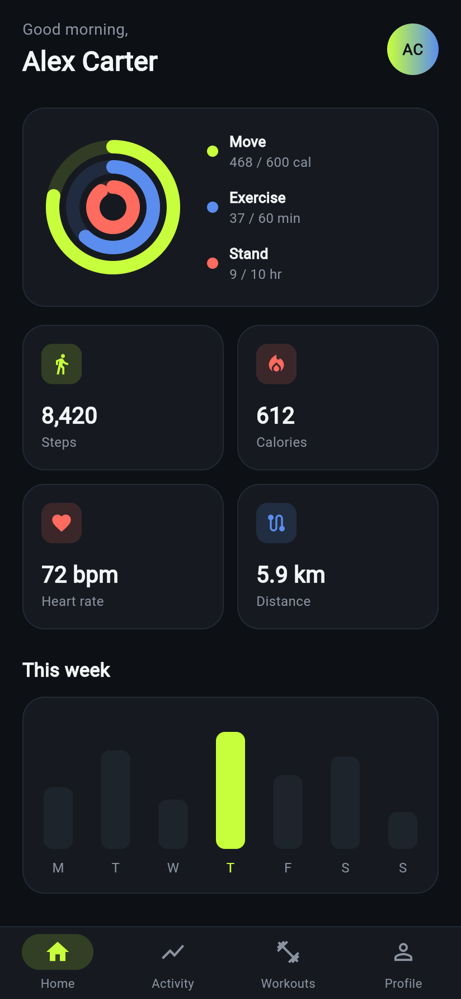

# FitTrack

A clean, modern **fitness & activity tracking** app UI, built with **Flutter** for
iOS and Android.

FitTrack shows how we approach mobile product design at Cabodex — a focused
dashboard, clear data visualization, and a calm dark interface that stays
readable while you move.

<p align="center">
  
</p>

## Features

- **Activity rings** — Move / Exercise / Stand progress, drawn with a custom painter
- **Daily stats** — steps, calories, heart rate and distance at a glance
- **Weekly overview** — a simple bar chart of the last seven days
- **Today's workout** — quick-start card for the day's session
- **Bottom navigation** — Home, Activity, Workouts and Profile

## Tech

- **Flutter** (Material 3), dependency-free codebase
- Custom `CustomPainter` for the activity rings
- Targets **Android** and **iOS** from one codebase

## Run it

```bash
flutter pub get
flutter run
```

## Project structure

```
lib/
  main.dart      # app, theme, dashboard, widgets & painters
test/
  widget_test.dart
```

---

© CABODEX LLC — mobile app development for iOS & Android · cabodex.com
